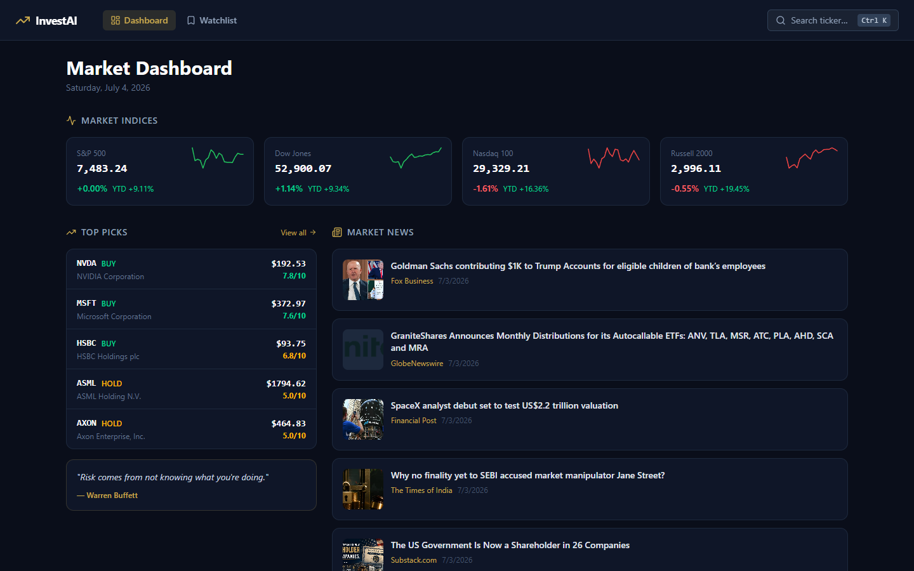
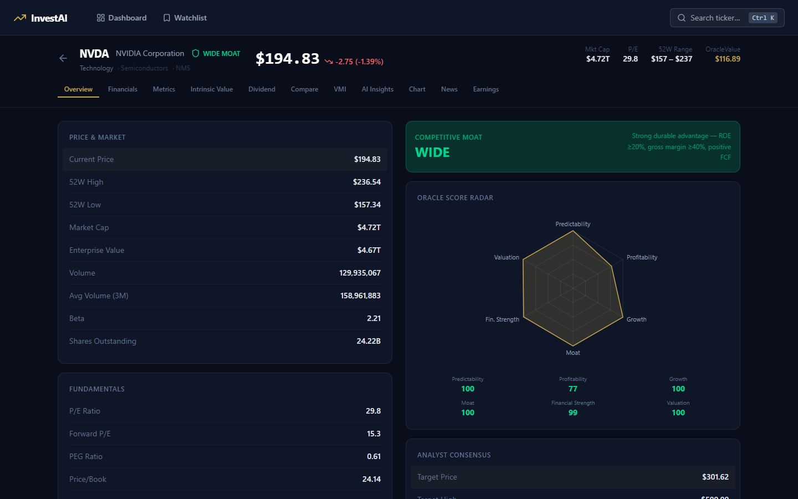
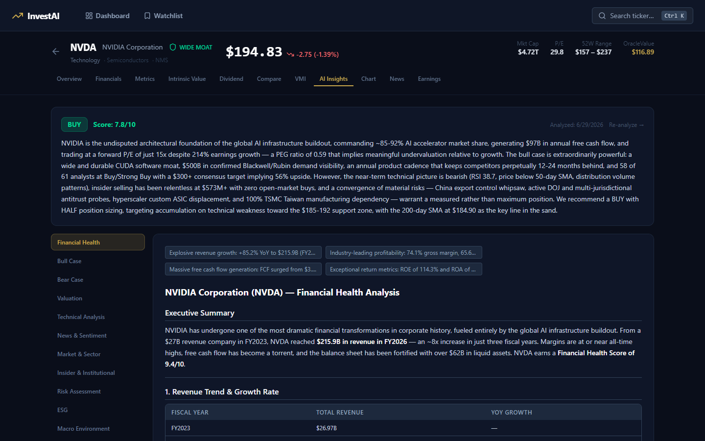

# InvestAI — Multi-Agent Value Stock Analysis

> An AI research platform that analyzes any public stock the way an investment committee would: a dozen specialist agents each study one dimension of the business, a bull and a bear argue the trade, and a Judge agent weighs the debate into a single, defensible verdict.

Built with a **FastAPI** backend orchestrating **11 parallel Claude agents** and a **Next.js 16 / React 19** frontend with interactive charts and tabbed analytics.

---

## Screenshots

**Market dashboard** — live indices, AI-rated top picks, and market news:



**Stock overview** — price & fundamentals beside the composite score radar and moat rating:



**AI Insights** — the Judge's verdict with the full multi-agent debate one click away:



---

## Why I built this

Most stock screeners hand you numbers and leave the reasoning to you. I wanted to see whether a **team of narrow, opinionated AI analysts** — deliberately disagreeing with each other — could produce a more honest, more balanced investment thesis than a single monolithic prompt. The result is a system where you can watch the bull case and the bear case get built independently, then reconciled.

## Architecture

```
                        ┌─────────────────────────────┐
   Ticker (e.g. AAPL) ─▶│        Orchestrator         │
                        │  (async, 3-way rate-limited)│
                        └──────────────┬──────────────┘
                                       │  fan-out (parallel)
        ┌──────────────┬──────────────┼──────────────┬──────────────┐
        ▼              ▼              ▼              ▼              ▼
   Financial      Valuation      Technical        News          Market
      Bull           Bear         Insider         Risk       ESG · Macro
        └──────────────┴──────────────┬──────────────┴──────────────┘
                                       │  11 structured reports
                                       ▼
                              ┌─────────────────┐
                              │   Judge Agent   │  weighs the debate,
                              │  (synthesis)    │  emits verdict + score
                              └────────┬────────┘
                                       ▼
                         SQLite (analysis + per-agent reports)
                                       ▼
                        Next.js dashboard — charts, tabs, watchlist
```

- **Fan-out / fan-in:** `orchestrator.py` launches all analysts with `asyncio.gather`, capping concurrency with a semaphore to respect API rate limits, and isolates failures so one agent crashing never sinks the run.
- **Structured outputs:** every agent returns a typed Pydantic report; a resilient JSON parser (code-fence stripping + `json-repair` fallback) tolerates messy LLM formatting.
- **Debate-then-judge:** independent Bull and Bear agents prevent single-prompt bias; the Judge only sees their finished cases.

## Tech stack

| Layer | Technology |
|---|---|
| AI | Anthropic Claude (Sonnet), 12-agent orchestration |
| Backend | FastAPI, SQLAlchemy, Pydantic, asyncio |
| Data | yfinance, Alpha Vantage, Tavily search, NewsAPI, SEC filings |
| Frontend | Next.js 16, React 19, TypeScript, Tailwind CSS 4 |
| Charts | lightweight-charts (candlesticks), Recharts (spider/radar) |
| Storage | SQLite |

## The agents

| Agent | Focus |
|---|---|
| Financial | Fundamentals, statements, profitability, balance-sheet health |
| Valuation | DCF & multiples, intrinsic value vs. price |
| Technical | Trend, momentum, support/resistance |
| Bull | Strongest case *for* buying |
| Bear | Strongest case *against* |
| News | Recent catalysts and sentiment |
| Market | Sector context and comparables |
| Insider | Insider transactions and ownership signals |
| Risk | Volatility, drawdown, downside scenarios |
| ESG | Environmental, social & governance factors |
| Macro | Rates, cycle, and macro exposure |
| **Judge** | Synthesizes all of the above into a rated verdict |

## Frontend

- **Stock dashboard** (`/stock/[ticker]`) with tabs: Overview, AI Insights, Financials, Valuation, Chart, Metrics, Earnings, Dividends, News, VMI, Compare.
- **Candlestick charts** and a **spider/radar** view of composite scores.
- **Watchlist** for tracking multiple tickers.

## Running locally

**Backend** (Python 3.11+):
```bash
cd backend
python -m venv .venv && .venv\Scripts\activate      # Windows
pip install -r requirements.txt
cp .env.example .env                                 # then add your API keys
uvicorn main:app --host 0.0.0.0 --port 8000
```

**Frontend** (Node 20+):
```bash
cd frontend
npm install
npm run dev
```

Open **http://localhost:3000**.

### Environment

`backend/.env` (never commit real keys — see `.env.example`):

```
ANTHROPIC_API_KEY=
TAVILY_API_KEY=
NEWS_API_KEY=
ALPHA_VANTAGE_API_KEY=
DATABASE_URL=sqlite:///./investai.db
```

## Roadmap

- [ ] Streaming agent progress to the UI over WebSocket
- [ ] Backtesting the Judge's verdicts against realized returns
- [ ] Postgres + pgvector for report retrieval and comparison over time
- [ ] Portfolio-level analysis across a whole watchlist

---

*Built by [@moleicafe](https://github.com/moleicafe). Educational project — not investment advice.*
